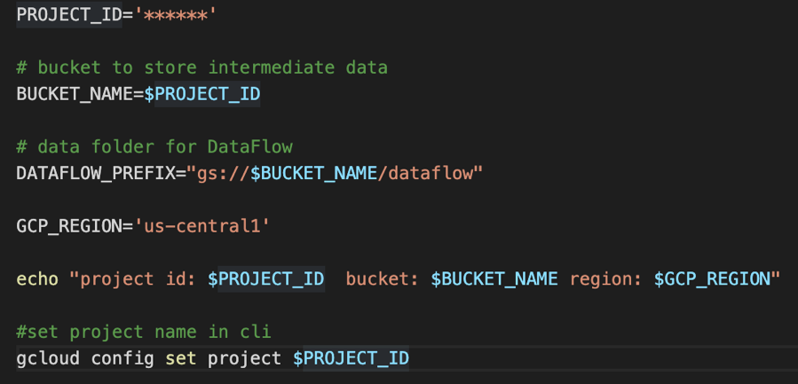
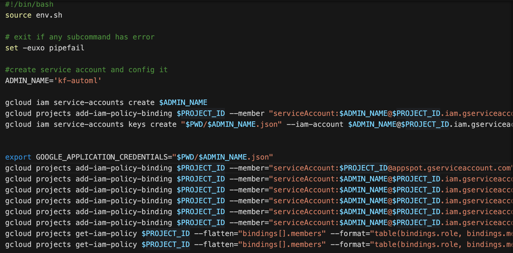
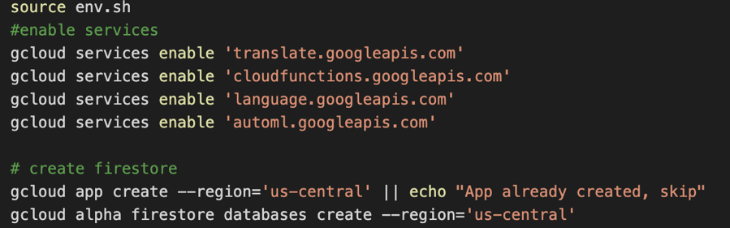
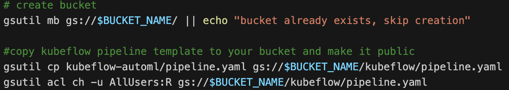
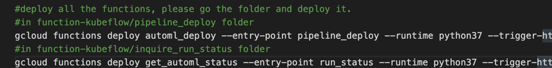
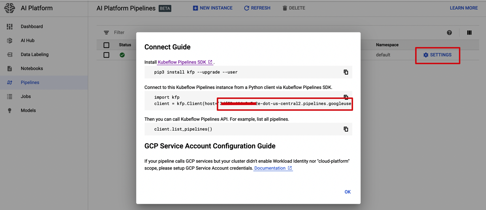
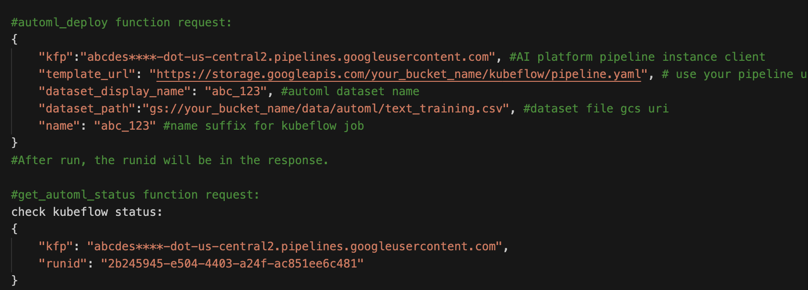
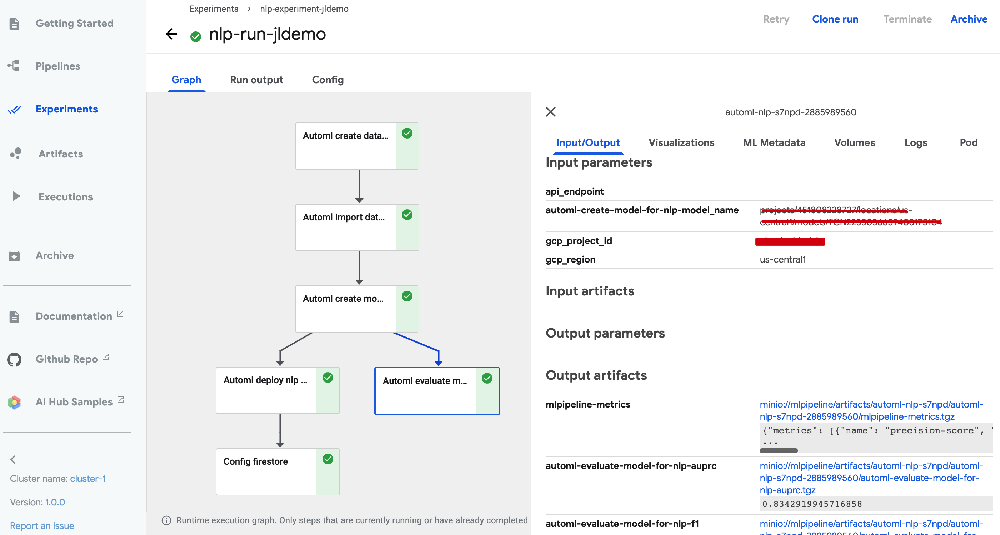
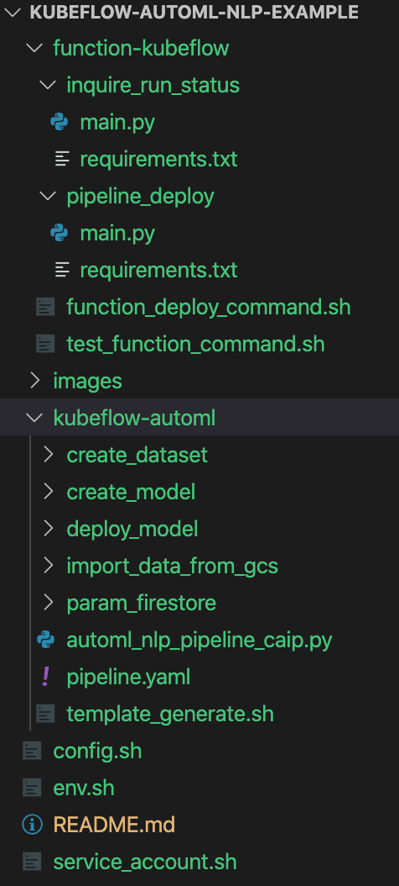

# Use GCP AI Platform Pipeline to build AutoML NLP Training and Deployment Pipeline

## Objective
This project is to use AI Platform Pipeline to orchestrate AutoML NLP Workflow, automating the data importing, training, evaluation and deployment process.

## Architecture

This project uses Function as a Http trigger. There are two functions, including pipeline deployment function, and pipeline status inquring function.

The whole workflow uses AI Platform pipeline(based on Kubeflow) as orchestrator. The core service is the pipeline is AutoML NLP service, for text classification model customization. After AutoML model is deployed, the model_id will be stored in Firestore.

## Deployment Steps

1. Create a project in GCP
2. Use *env.sh*, to config the project_id variables in CLI. When running *env.sh*, all the variables will be added to environment.

3. Use *service_account.sh*, modify the parameter of ADMIN_NAME, to config the service account.

4. Enable the related GCP service use *config.sh*
5. Create App Engine and Firestore use *config.sh*

6.	Use *config.sh* to create GCS bucket, copy the local Kubeflow template to that bucket, and set it as public.

7. Next, use commands in *config.sh* to deploy the two functions. automl_deploy is the automl pipeline function，get_automl_status is to inquire pipeline running status.

8. Open AI platform pipeline service in GCP UI, create an instance, and get the client url of this instance.

9. Use this client url and GCS path of the training data, we can call the Http function to start AutoML end-to-end workflow. In *test_function_command.sh* under function-kubeflow folder, we can see how to form the function request body.

To deploy AutoML pipeline, we put AI Platform Pipeline client url, Kubeflow template url, AutoML NLP dataset display name, training data GCS path, and Kubeflow name (to name this time's Kubeflow pipeline and run) in the body.

To inquire pipeline status, we put AI Platform Pipeline client url, and this time's run id(runid will be in the response body of above request) in the body.

10. After starting automl_deploy, we can also directly check the status in AI platform pipeline(Kubeflow) monitor UI.

## Code Description

1)	*config.sh*, *env.sh*, *service_account.sh* are all deployment related scripts.

2)	Function-kubeflow includes code of two functions, *function_deploy_command.sh* is the script to show how to deploy function (*config.sh* also has the command). *test_function_command.sh* is to show how to use the functions.

3)	Kubeflow-automl is the source code of pipeline template. You can also modify the source code and generate your own Kubeflow template using *template_generate.sh*. In *config.sh*, we directly upload the ready template from local to GCS.

